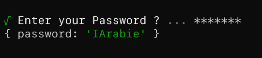

## Prompts
```ts
import Prompts, { PromptObject } from 'prompts';

const Questions: Array<PromptObject> = [
    {
        type: 'text',
        name: 'Username',
        message: 'Enter your Username ?'
    }
];

Prompts(Questions).then((Response) => {
    console.log(Response);
})
```


```ts
import Prompts, { PromptObject } from 'prompts';

const Questions: Array<PromptObject> = [
    {
        type: 'password',
        name: 'password',
        message: 'Enter your Password ?'
    }
];

Prompts(Questions).then((Response) => {
    console.log(Response);
})
```

